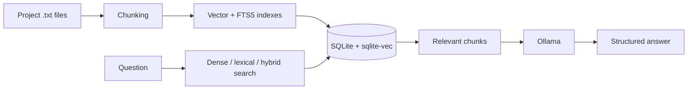

<pre align="center">
__  __     ______     ______     ______
/\ \/\ \   /\  == \   /\  __ \   /\  ___\
 \ \ \_\ \  \ \  __&lt;   \ \  __ \  \ \ \__ \
   \ \_____\  \ \_\ \_\  \ \_\ \_\  \ \_____\
    \/_____/   \/_/ /_/   \/_/\/_/   \/_____/
</pre>

<h1 align="center">University RAG CLI</h1>

<p align="center">
  Local-first RAG for indexing project documents and asking questions through Ollama.
</p>

<p align="center">
  
  
  
  
</p>

`urag` is a Kotlin/JVM command-line application that recursively indexes project `.txt` files, stores vector and FTS5 indexes locally in SQLite, retrieves relevant chunks, and generates structured answers with a local Ollama model.

## Highlights

- Fully local document indexing and question answering
- Dense vector search powered by `sqlite-vec`
- Separate index and query profiles selected by ID
- Configurable embedding model, chunking strategy, dense/lexical/hybrid retrieval, and `topK`
- Structured JSON responses from Ollama
- One-shot shell commands and a full-screen interactive terminal
- Persistent operation cancellation with `Ctrl+C`

## How it works



## Requirements

- JDK 21
- Ollama available at `http://localhost:11434`
- Embedding model `qwen3-embedding:8b`
- Question model `qwen3.5:9b`

Pull the default models:

```shell
ollama pull qwen3-embedding:8b
ollama pull qwen3.5:9b
```

## Build

Linux and macOS:

```shell
./gradlew build
```

Windows:

```powershell
.\gradlew.bat build
```

The executable fat JAR is created at `build/libs/urag.jar`.

## Quick start

List the available profiles and index either the whole project or one file:

```shell
java -jar build/libs/urag.jar profiles
java -jar build/libs/urag.jar index --all --config 1
java -jar build/libs/urag.jar index docs/admission.txt --config 1
```

Inspect project files and their indexing status:

```shell
java -jar build/libs/urag.jar files
java -jar build/libs/urag.jar files --config 1 --pending
```

Search without generation, or ask across all ready indexes:

```shell
java -jar build/libs/urag.jar search "What is dependency injection?" --all --profile 1 --explain
java -jar build/libs/urag.jar ask "Summarize this project" --all --profile 1 --output report.md
```

> [!IMPORTANT]
> `--config` selects an index profile. `--profile` selects a query profile. Both IDs are shown by `profiles`.

## Commands

The `/` prefix is required in interactive mode and optional in one-shot shell mode.

| Command | Description |
| --- | --- |
| `files [--config ID] [--indexed\|--pending\|--failed]` | List project text files and indexing status. |
| `index <file> --config ID` | Index one project text file. |
| `index --all --config ID` | Recursively index all project text files. |
| `unindex <file> [--config ID]` | Remove all stored indexes for a file, or only the selected index profile. |
| `profiles [index\|query]` | List index and query profiles. |
| `search "query" [--all\|--file PATH\|--index ID] [--profile ID] [--explain]` | Retrieve chunks without answer generation. |
| `ask "question" [--all\|--file PATH\|--index ID] [--profile ID] [--output FILE]` | Retrieve context and generate an answer. |
| `help` | Display the available commands. |
| `exit` | Exit interactive mode. |

Running without arguments, with `-h`, or with `--help` displays command help. Failed one-shot commands return a non-zero exit code.

## Interactive mode

```shell
java -jar build/libs/urag.jar --interactive
```

Start typing `/` to open command suggestions. Available terminal controls:

| Input | Action |
| --- | --- |
| `↑` / `↓` | Navigate command suggestions, including suggestions outside the visible window. |
| `Enter` | Complete the selected suggestion or execute the current command. |
| `Esc` | Close command suggestions. |
| `Page Up` / `Page Down` | Scroll through chat history. |
| Mouse wheel | Scroll through chat history. |
| `Ctrl+C` | Cancel the active operation; press again when idle to exit. |

Text can be selected normally with the mouse, without holding `Shift`.

## Configurations

Index profiles live in `src/main/resources/configurations/indexing`. They select the embedding model and chunking behavior:

```json
{
  "id": 1,
  "embeddingModel": "qwen3-embedding:8b",
  "chunkingStrategy": "FIXED_SIZE",
  "parameters": {
    "chunkSize": "1000"
  }
}
```

Query profiles live in `src/main/resources/configurations/query`. They select dense, lexical, or hybrid retrieval and control candidate and final result counts:

```json
{
  "id": 1,
  "parameters": {
    "retrievalMode": "hybrid",
    "denseCandidateLimit": "20",
    "lexicalCandidateLimit": "20",
    "rrfK": "60",
    "topK": "3"
  }
}
```

IDs must be unique within each profile type. Profiles are displayed in ascending ID order, and each type has a `default.json` marked with `*`.

The application stores only the SHA-256 hash of the selected index profile JSON in the database. Changing that file—including formatting—changes its hash and requires reindexing affected documents. Query profiles are selected at request time and are not persisted with an index.

## Runtime data

The current working directory is treated as the project root. Run the JAR from the directory whose documents should be indexed.

```text
.data/
├── university.db
└── logs/
    └── <timestamp>-<command>-<id>.json
```

- `.data/university.db` contains documents, chunks, index records, statuses, vectors, and the FTS5 index.
- `.data/logs/` contains automatic indexing, search, and answer-generation diagnostics, including duration and token usage.
- `.data` itself is excluded from recursive indexing.

> [!NOTE]
> The baseline migration describes a fresh database. When its schema changes during development, remove or migrate an existing `.data/university.db` before running indexing again.

## Tech stack

- Kotlin/JVM and Gradle
- Koin dependency injection
- Mordant terminal UI
- Kotlinx Serialization
- Ollama structured outputs
- SQLite, Flyway, and `sqlite-vec`
