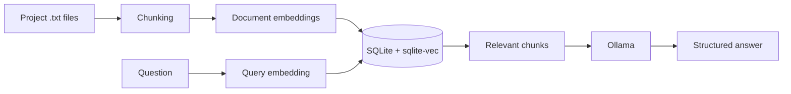

<pre align="center">
__  __     ______     ______     ______
/\ \/\ \   /\  == \   /\  __ \   /\  ___\
 \ \ \_\ \  \ \  __&lt;   \ \  __ \  \ \ \__ \
   \ \_____\  \ \_\ \_\  \ \_\ \_\  \ \_____\
    \/_____/   \/_/ /_/   \/_/\/_/   \/_____/
</pre>

<h1 align="center">University RAG CLI</h1>

<p align="center">
  Local-first RAG for indexing project documents and asking questions through Ollama.
</p>

<p align="center">
  
  
  
  
</p>

`urag` is a Kotlin/JVM command-line application that recursively indexes project `.txt` files, stores their vectors locally in SQLite, retrieves relevant chunks, and generates structured answers with a local Ollama model.

## Highlights

- Fully local document indexing and question answering
- Dense vector search powered by `sqlite-vec`
- Separate indexing and question configurations selected by ID
- Configurable embedding model, chunking strategy, and retrieval `topK`
- Structured JSON responses from Ollama
- One-shot shell commands and a full-screen interactive terminal
- Persistent operation cancellation with `Ctrl+C`

## How it works



## Requirements

- JDK 21
- Ollama available at `http://localhost:11434`
- Embedding model `qwen3-embedding:8b`
- Question model `qwen3.5:9b`

Pull the default models:

```shell
ollama pull qwen3-embedding:8b
ollama pull qwen3.5:9b
```

## Build

Linux and macOS:

```shell
./gradlew build
```

Windows:

```powershell
.\gradlew.bat build
```

The executable fat JAR is created at `build/libs/urag.jar`.

## Quick start

List the available indexing configurations and select one by its resource ID:

```shell
java -jar build/libs/urag.jar cf-index
java -jar build/libs/urag.jar index 1
```

Inspect the generated indexes and available question configurations:

```shell
java -jar build/libs/urag.jar list
java -jar build/libs/urag.jar cf-question
```

Retrieve context using an index ID from `list`, or ask a question using both the index ID and question-configuration ID:

```shell
java -jar build/libs/urag.jar relevant 1 "What is dependency injection?"
java -jar build/libs/urag.jar question 1 1 "Summarize this document"
```

> [!IMPORTANT]
> `/index` accepts an **indexing-configuration ID** shown by `cf-index`. `/question` accepts an **index ID** shown by `list`, followed by a **question-configuration ID** shown by `cf-question`.

## Commands

The `/` prefix is required in interactive mode and optional in one-shot shell mode.

| Command | Description |
| --- | --- |
| `cf-index` | List indexing configurations, their IDs, models, strategies, and parameters. |
| `index <configurationId>` | Recursively index project `.txt` files using the selected resource configuration. |
| `list` | Show stored indexes with source files, statuses, and indexing configurations. |
| `relevant <indexId> "question"` | Print the three chunks most relevant to the question. |
| `cf-question` | List question configurations and their parameters. |
| `question <indexId> <questionConfigurationId> "question"` | Retrieve configured context and generate an answer with Ollama. |
| `help` | Display the available commands. |
| `exit` | Exit interactive mode. |

Running without arguments, with `-h`, or with `--help` displays command help. Failed one-shot commands return a non-zero exit code.

## Interactive mode

```shell
java -jar build/libs/urag.jar --interactive
```

Start typing `/` to open command suggestions. Available terminal controls:

| Input | Action |
| --- | --- |
| `↑` / `↓` | Navigate command suggestions, including suggestions outside the visible window. |
| `Enter` | Complete the selected suggestion or execute the current command. |
| `Esc` | Close command suggestions. |
| `Page Up` / `Page Down` | Scroll through chat history. |
| Mouse wheel | Scroll through chat history. |
| `Ctrl+C` | Cancel the active operation; press again when idle to exit. |

Text can be selected normally with the mouse, without holding `Shift`.

## Configurations

Indexing configurations live in `src/main/resources/configurations/indexing`. They select the embedding model and chunking behavior:

```json
{
  "id": 1,
  "embeddingModel": "qwen3-embedding:8b",
  "chunkingStrategy": "FIXED_SIZE",
  "parameters": {
    "chunkSize": "1000"
  }
}
```

Question configurations live in `src/main/resources/configurations/question`. Currently they control how many relevant chunks are passed to the model:

```json
{
  "id": 1,
  "parameters": {
    "topK": "3"
  }
}
```

IDs must be unique within each configuration type. Configurations are displayed in ascending ID order, and each type has a `default.json` marked with `*`.

The application stores only the SHA-256 hash of the selected indexing JSON in the database. Changing that file—including formatting—changes its hash and requires reindexing affected documents. Question configurations are selected at request time and are not persisted with an index.

## Runtime data

The current working directory is treated as the project root. Run the JAR from the directory whose documents should be indexed.

```text
.data/
├── university.db
└── chunks/
    └── chunks_{indexId}.jsonl
```

- `.data/university.db` contains documents, index records, statuses, and vectors.
- `.data/chunks/` contains the generated document chunks.
- `.data` itself is excluded from recursive indexing.

> [!NOTE]
> The baseline migration describes a fresh database. When its schema changes during development, remove or migrate an existing `.data/university.db` before running indexing again.

## Tech stack

- Kotlin/JVM and Gradle
- Koin dependency injection
- Mordant terminal UI
- Kotlinx Serialization
- Ollama structured outputs
- SQLite, Flyway, and `sqlite-vec`
